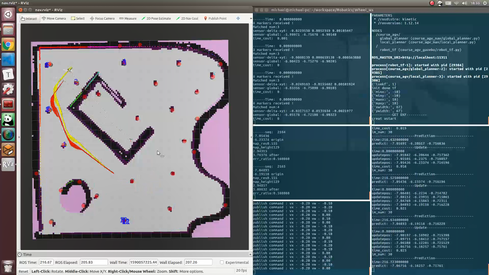
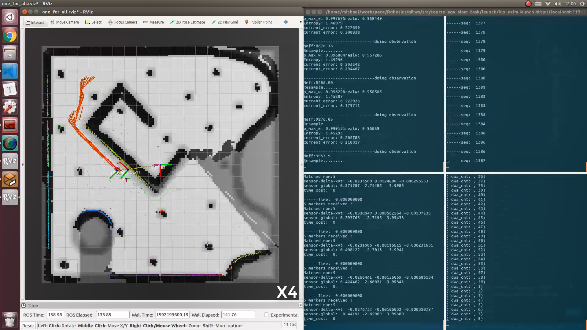

## ReadMe

以轮式差分机器人为仿真对象，共8次实验：

1. **<u>轨迹规划及运动控制</u>** - A*+DWA
2. **<u>ICP里程计</u>** - 点云直接配准ICP / 基于圆柱特征ICP
3. **<u>EKF-SLAM</u>** - 基于圆柱特征的EKF-SLAM
4. **<u>感知规划集成</u>** - 将实验3中的GAZEBO真值定位替换为EKF定位
5. **<u>占用栅格地图在线构建</u>** - 在实验4基础上增加实时贝叶斯占用栅格地图构建功能
6. **<u>蒙特卡洛定位</u>** - 实现粒子滤波定位
7. **<u>重规划</u>** - 用在线构建的地图进行路径规划，2种重规划规则：碰撞检测触发 / DWA失效触发
8. **<u>面向动态环境的MCL定位导航</u>** - 粒子滤波定位+动态地图构建+重规划

其中，<u>1-5</u>次实验构建了完整的EKF-SLAM系统，<u>6-8</u>次实验构建了粒子滤波定位+动态地图构建+重规划系统.

EKF-SLAM系统只有DWA局部轨迹规划避障，未加入路径重规划.（因为第8次的大作业有EKF和MCL2个选项，我选了MCL）

故代码仅上传了实验5和实验8代码，其中实验8代码`course_agv_slam_task`包部分做了规范注释.

### File

| Folder |  Presentation   |
| :----: | :-------------: |
| /code  |   实验5&8代码   |
|  /doc  |   实验1-8文档   |
| /video | 实验5&8视频结果 |

详细文档见`/doc`.

### Run

```
catkin build
```

##### Lab 5

```
roslaunch course_agv_slam_task icp_all.launch
roslaunch course_agv_slam_task ekf.launch
roslaunch course_agv_nav nav_for_all.launch
roslaunch course_agv_slam_task mapping.launch
rosrun course_agv_control keyboard_velocity.py
```

##### Lab 8

```
roslaunch course_agv_slam_task particle_filter.launch
roslaunch course_agv_nav replan.launch
roslaunch course_agv_slam_task mapping.launch
roslaunch course_agv_slam_task icp_exlm.launch
```

### Depends

Eigen 3.3.7

ROS related:

```
sudo apt-get install ros-kinetic-joint-state-publisher-gui ros-kinetic-joint-state-controller ros-kinetic-controller-manager ros-kinetic-gazebo-ros-pkgs ros-kinetic-gazebo-ros-control 
```

```
sudo apt-get install ros-kinetic-map-server
```

GAZEBO激光仿真有CPU和GPU2种模式，CPU模式无法很好地完成仿真，激光配置的修改参见`/doc/1轨迹规划及运动控制.pdf`.

### Video Screenshot

5_EKF-SLAM:



8_粒子滤波定位+动态地图构建+重规划:

粒子滤波定位+动态地图构建+重规划

### Comment

#### EKF-SLAM:

需要给定准确的robot位姿初值，不具备全局搜索能力，一旦定位短时间失效系统将崩溃。

不需要给定初始地图，可在线建图。

##### 遗留问题：

- EKF的prediction步骤用的是基于landmark set信息计算出的icp_odom信息，update步骤用的是landmark set信息，这样使prediction的意义不大
- EKF可以添加回环检测，修正累计误差

#### MCL定位：

具备全局搜索能力，有很好的鲁棒性，精度低于EKF；计算量较大，与粒子数正相关。

需要给定初始全局地图，在先验地图基础上更新地图，当动态障碍物过多，环境变化较大时系统失效。

##### 遗留问题：

- 经过地图左上角时icp_odom可能失效，因为匹配到的圆柱特则太少了，会触发跳帧操作，使中间几帧运动信息被省略，只能靠观测部分补偿。根本应该是icp里程计的问题。
- 在解决机器人绑架问题时，如果需要搜索范围广，那么粒子的高斯分布标准差应该扩大。而扩大后将使粒子变稀疏，在多数粒子聚集在真值附近而未到真值时（如距离位置真值0.2m处），将难以采样到真值点，收敛速度极慢。这应该是MCL方法本身性质决定的，以估计位置为中心，让粒子以高斯分布采样应该已经是最好的方法了。
- 定位精度依赖于栅格大小，栅格大小为0.1m时误差最小就在0.1m左右。可以采用四叉树二维地图，在障碍物与可通行区域交界处提高栅格分辨率。

